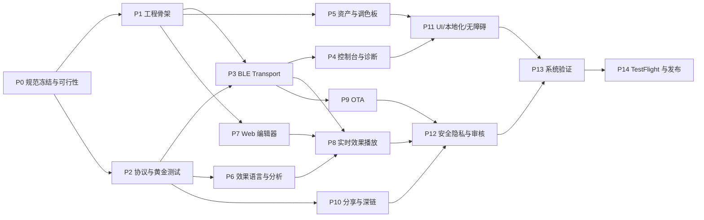

# Maurya Android → iOS 移植总计划与执行约束

> 文档状态：**执行基线 / Normative**
> 审计仓库：`git@github.com:ryujou/Maurya.git`
> 审计分支：`main`
> 审计提交：`56709f15cc0173d2c8b28fad8db68b7f48396844`
> 提交时间：`2026-08-06T21:33:04+08:00`
> 提交标题：`Merge latest Android ESP32 and Web sources`
> Android 版本：`4.2.1 (421)`
> 固件版本基线：`1.8.0`
> 文档建立日期：`2026-08-08`

---

## 0. 文档效力、使用方式与强制措辞

本文件是 Maurya iOS 移植工程的主计划、验收标准和变更约束。它不是一次性的建议清单。后续实现、代码审查、测试、发布和交接都必须引用本文件对应的 Phase、Gate 和验收项。

强制措辞定义：

- **MUST / 必须**：不满足则当前 Phase 不得完成，后续依赖 Phase 不得开始或合并。
- **MUST NOT / 禁止**：违反即为阻断缺陷，必须修复或取得书面例外。
- **SHOULD / 应当**：默认必须执行；偏离时须记录原因、影响、替代方案和批准人。
- **MAY / 可以**：按成本与收益选择，不影响最低验收线。
- **Gate / 阶段门**：进入下一阶段前必须具备的、可复核的客观证据。
- **Parity / 对等**：不仅“有类似页面”，还包括协议字节、算法结果、失败语义、权限降级、持久化格式和可恢复行为相符。

约束规则：

1. 后续任务不得仅以“界面已完成”宣布某 Phase 完成。
2. 每个完成项必须指向代码、测试、构建产物或人工验证记录之一。
3. 协议、效果脚本、分享格式、OTA 安全校验的行为变更，必须先更新本文件或对应 ADR，再改代码。
4. Android 当前实现是重要参考，但不是无条件正确的规范；Android、固件、编辑器和文档冲突时，必须在 Phase 0 形成唯一、版本化的协议决议。
5. 未通过 Phase 0 的阻断项不得用 iOS 端“猜测兼容”绕过。
6. 所有平台差异必须明确呈现给用户，不得伪装为完全等价能力。
7. 本计划的 Phase 可以并行开发，但 Gate 的依赖顺序不可跳过。

---

## 1. 最新版本与“分析功能”确认结论

### 1.1 GitHub 最新性

审计时本地 `main` 与 `origin/main` 均指向：

```text
56709f15cc0173d2c8b28fad8db68b7f48396844
```

已执行 `git fetch` 与 `git pull --ff-only origin main`，结果为 `Already up to date`。当前仓库只有需要保留的 `main` 主线工作基线。本计划必须以该提交为首个审计锚点；开始实际移植前仍须再次拉取，并在执行记录中填写新的 `SOURCE_COMMIT`。

### 1.2 分析功能确实存在

当前主线包含分析功能，但它不是一个独立命名为“分析”的页面，而是效果编程运行时的实时输入与算法系统：

- 麦克风输入：16 kHz 单声道分析，不保存、不上传原始音频。
- FFT：512 点，Hann 窗。
- 音频输出量：`AUDIO_LEVEL`、`AUDIO_PEAK`、`AUDIO_BASS`、`AUDIO_MID`、`AUDIO_TREBLE`、`AUDIO_BEAT`、`AUDIO_BPM`。
- 频带：低频 40–250 Hz、中频 250–2000 Hz、高频 2000–7500 Hz。
- BPM 限制：40–240。
- 运动输入：加速度 X/Y/Z、motion、shake、陀螺仪 X/Y/Z、pitch、roll、yaw、heading。
- 环境输入：light、near/proximity、pressure。
- 算法：插值、平滑、缓动、波形、噪声、随机、迟滞、死区、峰值保持、去抖、边沿、颜色、列表、图案和函数调用等。
- 虚拟输入：无真实传感器或权限时可用滑杆驱动脚本测试。

关键证据：

- `android/app/src/main/java/com/example/peacock/feature/effects/EffectSensorHub.kt`
- `android/app/src/main/java/com/example/peacock/feature/effects/EffectProgram.kt`
- `android/app/src/main/java/com/example/peacock/feature/effects/EffectRuntime.kt`
- `android/app/src/main/java/com/example/peacock/feature/effects/EffectScriptCompiler.kt`
- `android/app/src/androidTest/java/com/example/peacock/feature/effects/EffectSensorHubInstrumentedTest.kt`

因此，**iOS 首版若不包含上述分析链路，就不能称为 Android 4.2.1 当前主线的完整移植**。

---

## 2. 仓库复读范围与审计基线

### 2.1 规模快照

- Git 跟踪文件：2,894。
- 代码、脚本、配置、HTML/CSS/XML 等源文件：314。
- 上述源文件总行数：58,837。
- Android 主体：Kotlin + Jetpack Compose + Gradle。
- ESP32：ESP-IDF C 组件、host tests、固件配置和协议实现。
- Web：内嵌 Blockly/TypeScript 与代码编辑器构建产物、服务部署配置。
- Android 资源：角色、乐队、调色板、帮助内容、编辑器静态资源和中日文本。

### 2.2 已复读的关键边界

本计划基于以下边界的源码、测试和配置交叉阅读，而非仅阅读 README：

- Android Manifest、依赖版本、构建配置、应用入口和导航。
- BLE 扫描、连接、发现、通知订阅、分片写入、响应拼包、断线重连。
- Modbus RTU CRC、读写寄存器、多寄存器写入和 vendor function `0x41`。
- 运行时寄存器、7 组灯状态、诊断数据和温度/电压解析。
- 效果模型、编译器、解释器、预览、传感器中心、音频分析和 RAM 播放协议。
- Blockly 编辑器与代码编辑器的 JS Bridge、触控行为、加载/保存/运行接口。
- OTA manifest、签名、断点下载、设备能力检查、BLE 传输、状态恢复和提交。
- 分享 envelope、canonical JSON、gzip、SHA-256、二维码、深链、审核和导入历史。
- 自定义头像处理、调色板索引、尺寸限制和原子文件保存。
- 中日文资源、帮助说明和已有测试目录。
- ESP32 的 BLE transport、vendor protocol、效果帧、路由、flash layout 和 host tests。

### 2.3 当前测试可执行性说明

初次审计曾因 Gradle Wrapper 权限、JDK 与 Android SDK 路径无法执行 Android 测试。2026-08-08 已用 Homebrew OpenJDK 17 与 `/opt/homebrew/share/android-commandlinetools` 的 Android 36 SDK 重新执行 `testDebugUnitTest --rerun-tasks`，并执行 `assembleDebug`；当前结果通过。ESP32 host/Python/Web 与 Android editor tests 也已在当前工作区重跑。工具链路径应进入 CI，不再依赖历史测试报告。

---

## 3. 当前主线的 P0 阻断问题

### P0-01：42 灯真实规格与 70 灯残留漂移

**项目所有者已于 2026-08-08 确认：真实物理规格为 7 组 × 每组 6 颗 = 42 颗。** 该结论是当前硬件与首版 iOS 的 canonical geometry，不再属于待选产品决策。

初次审计时的仓库内部冲突如下；2026-08-08 已按本文件第 32 节完成代码层修复，但真机路由 Gate 尚未关闭：

- Kotlin `EffectGeometry`：7 组 × 每组 6 灯 = **42 灯**。
- Kotlin 像素帧长度：`14 + 42 × 3 = 140 bytes`。
- ESP32 `effect_types.h`：每组 6 灯，总计 **42 灯**。
- Android 编译器、解释器和测试多处限制为 42。
- 初次审计的已打包 Blockly JS 资源仍显示并生成“全部 **70** 颗/ピクセル”的概念，现已从可重建源统一为 42 并加入产物扫描测试。
- 初次审计的 `esp32/lumia_esp32/sdkconfig.defaults` 与 host-test `sdkconfig.h` 为每路 10 灯，现已统一为生产值 6。
- 初次审计的 `led_strip_driver.c` 通过编译期 `#error` 暴露该冲突；现已改为共享 geometry 常量与明确的物理清尾容量语义。
- 初次审计的根 `README.md` 与 ESP32 文档仍含 70 灯生产语义，现已修正；历史问题描述只作为审计证据保留。

影响：干净固件构建可能失败；编辑器生成的脚本语义与运行时限制不一致；iOS 若硬编码任一数值都可能兼容错误。

强制处理：

1. 固定 `groupCount = 7`、`pixelsPerGroup = 6`、`pixelCount = 42`；补充确认线性映射顺序和物理通道路由。
2. 删除或修复 Android、编辑器源代码与构建产物、固件 Kconfig/defaults、host tests、协议文档和帮助文本中的全部 70 灯语义。
3. CI 必须扫描关键源码与生成资源，禁止“全部 70 颗”、`7 × 10` 或等价旧协议常量重新进入主线；历史变更说明可加入 allowlist。
4. 推荐在设备信息 TLV/能力协商中返回几何，客户端以设备报告为准；未支持该 TLV 的当前固件按明确版本映射为 42。这样保留未来硬件扩展能力，但不得改变当前 42 灯事实。
5. 建立 0、首灯、每个 6 灯组边界、末灯 42、越界 43、反向通道路由的黄金向量。
6. 在本项关闭前，iOS 只可实现动态 geometry 模型和测试桩，不得发布像素级效果；本项关闭后，当前设备 fallback 必须为 42，不能回退为 70。

### P0-02：编辑器资源缺少单一来源

APK 中保存的是压缩后的编辑器 bundle；它可能与 Kotlin 常量脱节。必须定位可重建的编辑器源工程、锁定依赖、记录构建命令，并让灯数/协议版本通过生成的 shared schema 注入，而不是手工维护多份常量。

### P0-03：App Store 后台能力不能照搬 Android

Android 使用 `connectedDevice|microphone` 前台服务、通知和 wakelock 支持长时间效果播放。iOS 没有通用的“永久后台服务”：

- BLE central 背景模式只允许相关事件与系统调度，不保证任意高频定时器永久运行。
- 麦克风后台分析必须有 `audio` mode 和正在运行、可解释的 `AVAudioSession`，并始终显示系统麦克风指示。
- 用户强制退出后，系统不会为普通后台机制重启应用。
- 后台模式必须能向 App Review 说明实际用户价值，不能只是为了保活。

因此首要验收是“前台稳定运行 + 中断后可恢复”。后台实时效果属于独立可行性 Gate，不得提前承诺与 Android 完全等价。

### P0-04：iOS 无公开环境光传感器 API

Android 的 `SENSOR_LIGHT` 在 iPhone 上没有等价公开 API。iOS 必须：

- 保留脚本键名与解析兼容；
- 返回 unavailable/stale 状态，并允许虚拟输入；
- 在编辑器中明确显示平台不可用；
- 禁止用私有 API、屏幕亮度或摄像头偷偷模拟环境光；
- 如产品要求替代能力，必须作为新的、显式命名输入，经协议/脚本版本升级处理。

### P0-05：WebP 头像编码可行性

分享格式要求 96×96 WebP 且不超过 6,144 bytes。iOS 的系统图片栈对 WebP“解码可用”不代表“所有目标系统都可稳定编码”。必须做真实设备 Spike。失败时只能选择：引入经过许可与安全评审的小型编码器，或版本化扩展分享协议；不得静默改成 JPEG/PNG 后仍宣称兼容。

当前本地实现已选择并固定官方 Google libwebp 1.6.0，完成 96×96、≤6,144 bytes 的质量搜索、结构/hash 复核、Swift Testing 和 generic iOS build；BSD-3-Clause 许可已随 App 分发。此项的“能否编码”Spike 已关闭，但 Android↔iPhone 真机互导与视觉裁切一致性仍属于 Gate P5。

### P0-06：服务端合同不完整

仓库内可见客户端合同与反向代理配置，但未发现完整分享服务实现。Phase 0 必须获得服务端 API/OpenAPI、限流、错误码、内容保留策略、AASA 文件部署权和测试环境，否则分享/Universal Link 只能做到客户端离线单测，不能验收端到端。

---

## 4. 产品目标、范围与非目标

### 4.1 完整移植目标

iOS 应用必须支持：

1. 扫描、识别、连接、断开和自动重连 Maurya ESP32。
2. 读取/写入灯组参数、实时状态、诊断数据。
3. 内置角色与调色板、组合选择、自定义头像和本地调色板。
4. 效果程序库、Blockly 编辑、代码编辑、编译、解释、预览和运行。
5. 当前主线全部分析输入，按平台能力精确降级。
6. RAM 效果会话、组帧/像素帧、心跳和断线恢复。
7. 固件 OTA 的下载、签名/哈希验证、能力检查、断点传输、提交和重连验证。
8. 分享导出/导入、二维码、扫码、Universal Link、审核与导入历史。
9. 简体中文与日文，深色/浅色、Dynamic Type、VoiceOver、Reduce Motion。
10. App Store 隐私、权限、后台模式、法律素材和审核说明。

### 4.2 非目标

- 不在首版重写 ESP32 固件架构。
- 不将 Web 编辑器完全重写为原生 SwiftUI；首版保留已验证的 Blockly/CodeMirror 资产与交互语义。
- 不为追求“共享代码比例”引入 Kotlin Multiplatform、Flutter 或 React Native。
- 不在未定义版本协商时改变 wire protocol、share envelope 或脚本语言。
- 不收集、保存或上传麦克风原始音频。
- 不使用私有 API 获取环境光、后台保活或设备标识。
- 不把后台不可控执行包装成可靠保证。

---

## 5. 技术路线与架构决议

### 5.1 推荐路线

- UI：原生 SwiftUI。
- 语言：Swift 6 严格并发模式。
- 工具链：执行开始时使用可提交 App Store 的当前 Xcode；本计划建立时以 Xcode 26+/SDK 26+ 为审核快照，发布前必须重查。
- 最低系统：**暂定 iOS 17.0**，在 Phase 0 ADR 中确认；iOS 26 API 只做条件增强。
- 平台：iPhone 必须；iPad 采用自适应布局并纳入测试。如决定仅 iPhone，须在 Phase 0 明确并修改 App Store 媒体计划。
- 依赖策略：优先 Apple 原生框架；引入第三方库必须附许可证、隐私 manifest、维护状态、二进制体积和移除方案。
- 架构：feature-first + 可独立测试的 pure Swift domain packages。

### 5.2 不选择跨平台框架的原因

该项目最困难的部分是 CoreBluetooth、AVAudioEngine/vDSP、CoreMotion、后台生命周期、WKWebView bridge、权限与 App Store 合规，而不是普通 CRUD UI。跨平台层不会消除这些原生工作，反而会增加 bridge、线程、生命周期和包体风险。现有 Android 也无需被重构来配合 iOS。

若未来决定跨平台，必须新建 ADR，对比 Flutter、React Native、Kotlin Multiplatform 的 BLE 高频流、音频实时线程、WebView bridge、后台模式、Swift 并发与维护成本；不得直接替换本计划的原生路线。

### 5.3 建议模块边界

```text
MauryaIOS/
├── App/                         # 启动、依赖组装、路由、scene lifecycle
├── DesignSystem/                # token、主题、组件、动效、无障碍
├── Features/
│   ├── Discovery/
│   ├── DeviceConsole/
│   ├── Palettes/
│   ├── EffectsLibrary/
│   ├── EffectsEditor/
│   ├── EffectsPlayback/
│   ├── OTA/
│   ├── Sharing/
│   └── Help/
├── Services/
│   ├── Bluetooth/
│   ├── Motion/
│   ├── AudioAnalysis/
│   ├── Networking/
│   ├── Persistence/
│   └── WebEditor/
├── Packages/
│   ├── MauryaProtocol/          # CRC、Modbus、vendor frames、TLV
│   ├── MauryaEffects/           # AST、编译器、解释器、算法
│   └── MauryaShare/             # canonical JSON、验证、gzip、hash
├── Resources/
│   ├── Assets.xcassets
│   ├── Localizable.xcstrings
│   └── EffectEditor/
├── Tests/
├── UITests/
└── TestFixtures/                # 跨 Android/ESP32/iOS 黄金向量
```

### 5.4 并发模型

- `BluetoothTransport` 必须由 actor 串行化所有 request/response transaction。
- 每个请求必须具有 request ID/内部 token、超时、取消和连接代次，旧连接回调不得完成新连接请求。
- CoreBluetooth delegate 回调通过单一 bridge 转为 `AsyncStream` 或受控 continuation。
- continuation 必须且只能 resume 一次；超时、取消、断线和 delegate error 必须竞争安全。
- UI 可观察状态在 `@MainActor`；协议解析、FFT、编译和 gzip/hash 不占用主线程。
- 音频 tap 运行在实时线程，不得访问 MainActor、分配大对象、进行文件/网络/BLE 写入或无界锁等待。
- 所有长任务必须检查取消，并在停止播放、断线、页面退出和应用进入后台策略变更时释放资源。

---

## 6. 必须使用的 Skills 与使用阶段

以下 Skills 构成本项目的工程检查表。使用某 Skill 意味着其规则要转化为代码审查和测试证据，而非只在提示词中提到名称。

| Skill | 适用 Phase | 强制产出 |
|---|---:|---|
| `github:github` | 0、每次开工、14 | 远端分支/提交核对、PR/Issue 上下文、可追溯源提交 |
| `android-kotlin-development` | 0、2、6、9、10 | Android 行为基线、测试映射、协议与业务语义对照 |
| `swiftui-pro` | 1、4、5、7、10、11 | 现代 SwiftUI、Observation、导航、性能与可维护性审查 |
| `swift-concurrency-pro` | 1–10、13 | actor 隔离、Sendable、取消、continuation、数据竞争审查 |
| `swift-testing-pro` | 1–14 | Swift Testing 结构、traits、异步测试、参数化黄金测试 |
| `core-bluetooth` | 0、3、8、9、13 | 状态机、分片、流控、恢复、真实硬件测试 |
| `core-motion` | 0、6、13 | 可用性检查、采样生命周期、权限与平台降级矩阵 |
| `ios-networking` | 9、10、12 | URLSession async/await、重试、Range、缓存、TLS、错误映射 |
| `background-execution` | 0、8、9、12、13 | 前后台策略、expiration、force-quit 降级、真实设备证据 |
| `swiftui-webkit` | 0、7、12 | WebView/WebPage 选型、导航限制、JS bridge 与生命周期 |
| `apple-design` | 1、4、5、7、11 | 即时反馈、可中断动效、空间一致性、Reduced Motion、Dynamic Type |
| `app-store-review` | 0、12、14 | 当日政策核查、隐私证据、entitlement、metadata 与审核说明 |

Skill 使用约束：

1. 开始对应 Phase 前重新读取当时安装的最新版 Skill。
2. Skill 与项目既有协议冲突时，协议数据不随意修改；创建 ADR 解释平台适配。
3. App Store 相关事实具有时效性，Phase 12 与 Phase 14 必须联网复查 Apple 官方来源并记录日期。
4. 代码合并前，PR 模板必须列出本次实际使用的 Skill 和已执行检查。

---

## 7. 功能对等与平台映射

| Android 能力 | iOS 实现 | 对等标准 | 已知差异/风险 |
|---|---|---|---|
| BLE 扫描 | CoreBluetooth central | Maurya 名称/FFE0 识别、去重、RSSI、状态提示 | 后台扫描必须指定 service UUID，发现行为受系统限制 |
| MTU 247 请求 | `maximumWriteValueLength` | 按系统值动态分片 | iOS 不能主动请求指定 MTU |
| 串行请求 | actor transaction queue | 同一时刻一个协议事务、超时/取消/断线确定 | delegate 回调乱序需连接代次保护 |
| Modbus RTU | pure Swift codec | 字节完全一致、CRC 黄金向量一致 | 必须处理通知粘包与多帧余量 |
| 灯组控制 | SwiftUI + register repository | 读写值、错误、刷新一致 | 真实规格为 42；代码/产物扫描已清除生产 70 语义，实物路由仍需验收 |
| 内置资产 | Asset Catalog/bundle | 条目数、ID、颜色和归属一致 | 法律/商标与包体需复核 |
| 自定义头像 | PhotosPicker + crop + pinned libwebp | 96×96、≤6144 bytes、hash/持久化一致 | 编码已实现；需 Android↔iPhone 真机互导与视觉 QA |
| Blockly/代码编辑器 | WKWebView wrapper | load/save/undo/redo/run/field edit 行为一致 | bridge API 与 Android JS interface 不同 |
| 编译/解释 | pure Swift port | AST、错误位置、输出帧和算法 golden 一致 | 浮点与随机数必须定义容差/种子 |
| 音频分析 | AVAudioEngine + Accelerate/vDSP | 16k/512/Hann/频带/beat/BPM 等价 | 路由采样率需重采样，实时线程不可阻塞 |
| 运动分析 | CoreMotion | 可用输入和 stale 语义一致 | light 不可用；heading/pressure 依设备/权限 |
| RAM 播放 | Task clock + BLE actor | 组帧 100ms、像素帧 50ms、心跳 1s | 后台持续性不保证 |
| OTA 下载 | URLSession + Security.framework | manifest、签名、hash、Range、重连一致 | RSA 用 `SecKeyVerifySignature`，非 CryptoKit RSA |
| 分享 API | URLSession | envelope、gzip、hash、错误一致 | 需服务端合同与测试环境 |
| 二维码 | CoreImage + AVFoundation | token 生成/识别、权限降级 | 相机实机测试 |
| App Link | Universal Links | `/maurya/s/{token}` 打开并导入 | 需要 AASA 与 Associated Domains |

### 7.1 传感器能力矩阵

| 脚本输入 | iOS 来源 | 状态 | 强制降级 |
|---|---|---|---|
| accel X/Y/Z | `CMMotionManager` | 支持 | 不可用时 stale + virtual |
| motion/shake | userAcceleration 派生 | 支持，需移植阈值 | 黄金轨迹回放验证 |
| gyro X/Y/Z | gyro/deviceMotion | 支持 | 设备不支持时 stale |
| pitch/roll/yaw | deviceMotion attitude | 支持 | 明确弧度/角度与坐标系 |
| heading | deviceMotion heading 或 CoreLocation | 条件支持 | 若用 CoreLocation，单独说明权限；不得暗中请求 Always |
| pressure | `CMAltimeter` | 条件支持 | 无气压计时 stale + virtual |
| near | `UIDevice` proximity monitoring | 条件支持 | 验证机型；页面退出立即关闭 |
| light | 无公开等价 API | 不支持 | 编辑器标识 unavailable，保留 virtual |
| audio level/peak | AVAudioEngine | 支持 | 麦克风拒绝时 virtual/清晰提示 |
| bass/mid/treble | vDSP FFT | 支持 | 输入格式统一到 16 kHz mono |
| beat/BPM | Swift 算法移植 | 支持 | 与 Android 录制夹具比较 |

---

## 8. Wire Protocol 固定基线

### 8.1 BLE GATT

- Service：`FFE0`
- Write Characteristic：`FFE1`
- Notify Characteristic：`FFE2`
- Notify 必须启用；未成功订阅前不得发送协议请求。
- Android 因部分广播缺失 service UUID，会前台扫描后再按名称 `Maurya-` 或 FFE0 过滤；iOS 前台可采用同样回退，但后台扫描必须遵守 CoreBluetooth UUID 规则。
- 写入默认采用 `.withResponse`；只有经固件压力测试确认的流式路径才可考虑 `.withoutResponse` 并实现 `canSendWriteWithoutResponse` 流控。

### 8.2 Modbus RTU

- 支持 function：`0x03`、`0x06`、`0x10`、vendor `0x41`。
- CRC16 polynomial：`0xA001`，CRC 在帧末低字节在前。
- 解析器必须处理：空通知、半帧、多通知拼一帧、一次通知多帧、异常响应、错误 CRC、错误地址、超长帧和连接切换残留。
- 禁止在收到第一帧后丢弃缓冲区剩余数据。

### 8.3 OTA vendor 命令

- `0x01` GET_INFO
- `0x02` PREPARE
- `0x03` CANCEL
- `0x10` BLE_BEGIN
- `0x11` BLE_DATA
- `0x12` BLE_STATUS
- `0x14` BLE_COMMIT
- `0x15` BLE_CANCEL

当前 Android BLE data payload 以 118 bytes 为基线，但 iOS 必须根据 GATT write capacity 和协议上限取安全值，不得假设固定 ATT MTU。

### 8.4 Effects vendor 命令

- `0x20` BEGIN
- `0x21` GROUP_FRAME
- `0x22` HEARTBEAT
- `0x23` END
- `0x24` PIXEL_FRAME
- 当前组帧周期 100 ms，像素帧周期 50 ms，心跳周期 1 s。
- capability：volatile effect `0x20`、pixel effect `0x40`。
- 会话只驻留 RAM；重连后必须重新 BEGIN，不能假设设备保留会话。

### 8.5 分享合同

- Origin：`https://xtbang.top`
- POST：`/maurya/api/share/v1/shares`
- GET metadata/blob：按当前 Android repository 合同固化为 contract tests。
- Media type：`application/vnd.maurya.share+gzip`
- token：10 字符，UI 可格式化为 `5-5`。
- Universal Link：`https://xtbang.top/maurya/s/{token}`。
- payload：canonical JSON → gzip → SHA-256，导入必须重新验证大小、深度、类型、hash 和业务限制。

---

## 9. Phase 总览与依赖



---

## 10. Phase 0 — 规范冻结、基线复现与高风险 Spike

### 目标

把“当前代码实际上做什么”转成唯一、可测试、可版本化的跨端合同，并在投入大量 UI 工作前消除不可行假设。

### 必须完成

1. 再次同步 `origin/main`，记录 Android、ESP32、Web、server 的源提交；工作树必须可解释。
2. 安装项目要求的 JDK/Android SDK/ESP-IDF/Node 版本，运行全部现有测试。
3. 保存测试命令、工具版本、通过/失败数量和日志摘要。
4. 按已确认的 42 灯真实规格解决 P0-01；同一提交中修复 Kotlin、编辑器、固件配置、host tests 和文档，并移除 70 灯残留。
5. 生成 `protocol-schema` 或等价单一来源，至少包含 UUID、命令、能力位、geometry、寄存器、最大尺寸和版本。
6. 从 Android/ESP32 生成黄金夹具：CRC、Modbus、vendor TLV、group/pixel frames、script compile、algorithm、share envelope。
7. 选定 iOS deployment target、设备范围、App ID、Team、签名与 Associated Domains 责任人。
8. Spike：CoreBluetooth 对真实 ESP32 的扫描、连接、通知、分片写和断线重连。
9. Spike：AVAudioEngine → 16 kHz mono → vDSP 512 FFT → 7 个分析输出。
10. Spike：WebP 96×96 ≤6144 bytes 编码与 Android 互导。
11. Spike：WKWebView 加载本地编辑器、消息 bridge、阻止外链、保存/恢复状态。
12. Spike：前台 20 Hz 像素帧 + 1 Hz 心跳，测吞吐、延迟、丢包、发热和耗电。
13. 验证服务器分享 API、TLS、错误码、限流、AASA 部署与测试环境。
14. 创建 ADR：原生 SwiftUI 路线、最低系统、后台支持边界、geometry/version negotiation、依赖策略。

### 交付物

- `BASELINE.md` 或执行记录，包含所有版本和日志链接。
- 协议 schema、黄金夹具目录及生成方式。
- 至少 6 份 ADR。
- 5 个 Spike 的可运行代码或独立实验 target，以及结论表。
- 已关闭 P0-01～P0-06，或对确实外部阻塞项记录负责人、截止日期和禁止进入的下游 Phase。

### Gate P0

- Android、ESP32 host tests、Web editor tests 在固定工具链可复现。
- canonical geometry 明确为 7×6=42，所有活动代码、生成资源、配置、测试和文档一致，且自动测试能防止 70 灯残留再次漂移。
- iPhone 真机可与 ESP32 完成一轮 request/response。
- 音频分析、WebP、WKWebView、BLE 20 Hz 均给出可行/不可行的客观数据。
- 不存在“以后再决定但已经硬编码”的关键参数。

### 禁止项

- 不允许用 README 替代 wire bytes。
- 不允许复制 Android 常量后跳过 cross-platform golden test。
- 不允许在 Spike 中使用最终产品禁止的私有 API。

---

## 11. Phase 1 — iOS 工程骨架、设计系统与 CI

### 目标

建立可持续开发、严格并发、可测试和可发布的工程基础。

### 必须完成

1. 创建 Xcode project/workspace 与上述模块边界。
2. 启用 Swift 6 严格并发和 warnings-as-errors 的 CI 策略；对必要例外逐项注释。
3. 建立 Debug/Staging/Release 配置，服务 URL 与日志级别不得散落硬编码。
4. 建立依赖注入 composition root；Preview/Test 使用 fake services。
5. SwiftUI 根路由使用 `NavigationStack`；定义 scan、device detail、share import 和 deep link route。
6. 建立 `@Observable` 状态模型；禁止 View 持有协议传输细节。
7. 建立设计 token：背景、金色强调、表面层级、间距、圆角、字体、图标和状态色。
8. 建立 Loading/Empty/Error/Permission/Disconnected 通用状态组件。
9. 建立 OSLog categories，Release 不记录 token、payload、设备敏感信息或原始音频。
10. 建立 Swift Testing、UI Testing、snapshot/视觉基线策略和 test fixture bundle。
11. CI 执行 build、unit tests、lint/format、`git diff --check`、资源/schema 漂移检查。

### 设计约束

- 交互按下立即反馈；可拖拽/Sheet 动效可中断。
- 默认系统字体和 Dynamic Type，不以固定 frame 裁切文本。
- Reduce Motion 时用交叉淡化或静态变化替代大幅滑动/弹簧。
- Reduce Transparency/Increase Contrast 下仍清晰。
- 所有关键状态不仅依赖颜色表达。

### Gate P1

- Debug/Staging/Release 均能在 CI 构建。
- 无数据竞争警告和未解释的 `@unchecked Sendable`。
- 根导航、依赖替身、三种语言状态（zh-Hans、ja、fallback）能运行。
- 新开发者按 README 可在干净环境 30 分钟内跑起项目。

---

## 12. Phase 2 — Pure Swift 协议、领域模型与黄金测试

### 目标

在不依赖蓝牙、UI 或网络的条件下，完成所有可确定行为的等价移植。

### 必须完成

1. `MauryaProtocol`：Data reader/writer、LE/BE 明确 API、CRC16、Modbus codec、异常帧、vendor envelope、TLV。
2. 运行时寄存器：全局、7 组、stride、诊断、signed temperature、VDDA 等模型。
3. 增量 frame decoder：支持半帧、粘包、多帧、噪声前缀的明确处理策略和最大缓冲限制。
4. OTA info/status/manifest 模型和严格 decoder。
5. Effects group/pixel frame codec 使用 negotiated geometry；当前设备与无协商旧固件 fallback 为 42。除 schema/兼容性测试外禁止散落数字 42，更禁止活动代码保留 70。
6. Share domain：版本、类型、最大深度、最大字段长度、canonical key order、gzip、hash。
7. 错误 taxonomy：transport、timeout、protocol、device exception、validation、permission、server、storage。
8. 将 Android 错误语义映射为 iOS 本地化 error presentation，不直接在底层拼接中日双语字符串。

### 必测边界

- CRC 空输入、典型请求、单 bit 破坏。
- 0、1、最大寄存器数量；溢出地址；错误 byte count。
- TLV 重复 key、未知 key、截断 length、超长 payload。
- signed/unsigned 边界、NaN/Infinity 禁止进入协议。
- frame decoder 每个切分位置参数化测试。
- geometry 为 42、70、未知、0 和超上限时的处理。
- canonical JSON 在 Android/iOS 生成的字节与 SHA-256 完全相同。

### Gate P2

- 全部 Android/ESP32 黄金向量在 iOS 通过。
- 纯 Swift package 在 macOS CI 无 iOS runtime 也能测试。
- fuzz/property tests 不出现崩溃、无界内存增长或越界读。
- 协议覆盖率达到团队约定门槛，关键 codec 分支 100%。

---

## 13. Phase 3 — CoreBluetooth Transport 与连接状态机

### 目标

提供稳定、可取消、可恢复、与 UI 解耦的 BLE 层。

### 状态机

```text
idle → waitingForBluetooth → scanning → connecting
→ discoveringServices → discoveringCharacteristics → subscribing
→ ready → disconnecting → idle
                         ↘ reconnectBackoff ↗
```

每个转移必须有事件、超时、错误和用户取消路径。禁止用多个布尔值形成不可能组合。

### 必须完成

1. 扫描 dedupe、RSSI 更新、名称/UUID 回退过滤和扫描超时。
2. 保存 peripheral UUID；前台启动时先 retrieve，再按策略扫描。
3. 仅在 FFE1/FFE2 与 notify subscription 都准备完毕时进入 ready。
4. 根据 `maximumWriteValueLength(for: .withResponse)` 分片。
5. 每个 chunk 等待 `didWriteValueFor` 或明确失败；大传输支持进度和取消。
6. transaction actor 串行 Modbus/vendor request；通知 decoder 独立持续运行。
7. 默认响应超时以 Android 2 秒为基线，可按 OTA/命令类型覆盖。
8. 自动重连采用有上限指数退避，参考 Android 最大 45 秒；用户主动断开不重连。
9. 实现 CoreBluetooth state preservation/restoration 的最小可用路径，但不得宣称系统必定恢复。
10. App 进入后台、蓝牙关闭、权限变化、设备重启、通知关闭均有明确状态。

### 真机测试矩阵

- 首次授权允许/拒绝/稍后在 Settings 开启。
- 蓝牙开关关闭再开启。
- 扫描时设备上电/下电。
- 连接各阶段强制断电。
- 连续 1000 次短请求。
- 20 Hz 帧流至少 30 分钟。
- OTA 大传输期间电话/锁屏/切后台。
- 两台同名 Maurya 设备同时出现。

### Gate P3

- 真实 ESP32 完成 1000 次请求无死锁、无串帧。
- 所有 continuation 在测试中证明单次 resume。
- Instruments/Memory Graph 无 peripheral/delegate/task 泄漏。
- 断电后恢复路径不需要杀 App。

---

## 14. Phase 4 — 设备控制台、寄存器与诊断

### 目标

完成从扫描到设备日常控制的第一条可用垂直切片。

### 必须完成

1. 扫描页、连接进度、失败原因与重试。
2. Detail 页面按信息层次映射 Console、Characters/Palette、Help/OTA、Effects。
3. 全局开关与 7 组灯的 HSV/mode 状态读取、编辑和提交。
4. Slider 拖动期间节流，松手提交最终值；失败时回滚或标记未同步。
5. 设备状态刷新、温度、VDDA、错误计数和诊断信息。
6. 并发编辑冲突策略：本地 pending 值、设备回读值和错误状态可区分。
7. 连接丢失时所有写控件禁用，保留最后值但明确标记 stale。
8. VoiceOver 为每组、颜色、亮度、模式提供完整 label/value/action。

### Gate P4

- 七组读写与 Android 对照一致。
- 快速滑动不造成请求队列无限增长。
- 断线不会显示“保存成功”。
- 小屏、最大 Dynamic Type、横屏和 iPad 分屏不遮挡关键操作。

---

## 15. Phase 5 — 内置资源、自定义头像与调色板

### 目标

迁移当前资产库和自定义调色板，同时控制法律、包体与数据完整性。

### 必须完成

1. 生成 asset inventory：稳定 ID、显示名、乐队、颜色、文件 hash、来源和许可证。
2. 对比 Android 资产数量与 iOS bundle，CI 阻止漏项或重复 ID。
3. 图片按用途优化，不无条件放大；测量安装包和首次解码内存。
4. PhotosPicker 导入、方形裁剪、96×96 处理、WebP 压缩、6144-byte 限制。
5. 自定义 palette 最大 50；达到上限时给出可操作提示。
6. 索引和文件使用 Application Support、原子写入、合适 file protection；孤儿文件可修复。
7. 删除前展示影响；可恢复操作优先，至少在当前会话提供 Undo。
8. Android 导出的自定义头像/分享 envelope 可在 iOS 导入，反向亦然。
9. 法律审查所有角色、乐队名称、图像、商标和免责声明。

### Gate P5

- 资源 inventory 100% 对齐并通过 hash 检查。
- 50 项边界、损坏索引、磁盘写失败、无权限图片均有测试。
- WebP Android↔iOS 双向互操作通过。
- 法律素材状态没有“未知但先发布”。

---

## 16. Phase 6 — 效果语言、算法运行时与实时分析

### 目标

完整移植当前主线最核心、也是“分析功能”所在的效果系统。

### 6A：模型、编译器和解释器

1. 逐项移植 EffectProgram/AST、类型系统、变量、列表、函数和控制流。
2. 保持语法、关键字、错误位置、错误类别和限制一致。
3. 移植全部 builtin：数学、缓动、wave、random/noise/fBm、颜色、list、pattern、debounce/edge/hysteresis/peak hold。
4. 定义浮点语义、角度单位、颜色舍入、HSV 边界和 random seed。
5. 运行时设置 instruction/time/list/depth 限制，恶意脚本不能锁死线程或无限占内存。
6. 编译与执行放在可取消 Task；UI 只接收节流后的 snapshot。

### 6B：音频分析

1. 仅在用户开始需要 audio input 的效果时请求麦克风权限。
2. AVAudioSession 激活时机、category/mode/options 由 Spike 和产品体验决定；不得 App 启动即占用麦克风。
3. AVAudioEngine tap 在 nonisolated 实时路径执行，使用预分配 ring buffer。
4. 将设备输入转换为 16 kHz mono；不得假设硬件原生采样率。
5. vDSP 实现 512 FFT、Hann window、level、peak 和三个频带。
6. 移植 beat detector 与 BPM 40–240 算法。
7. 中断开始立即标记 audio stale；仅在系统建议且播放会话仍有效时恢复。
8. route change 后重建格式与 converter；不继续使用旧 format。
9. 原始 PCM 不落盘、不上传、不进入日志。

### 6C：运动与环境分析

1. 仅订阅当前脚本实际用到的 sensor，页面/播放停止时立即停采样。
2. 明确 Android 与 iOS 坐标系转换；使用记录轨迹做 golden replay。
3. 为每个 input 保存 value、timestamp、availability、permission、stale。
4. UI 更新频率与内部采样频率分离。
5. light 标记 unsupported；virtual input 可覆盖。
6. heading 若引入位置权限，必须单独 ADR 和产品说明；默认优先不扩大权限。

### 分析验收

- 使用同一批 WAV/PCM fixture 比较 Android 与 iOS 的 level/peak/bands/beat/BPM。
- band/level 设数值容差，beat 时间和 BPM 设时间容差；容差必须基于实测而非随意放宽。
- 静音、正弦扫频、脉冲、粉红噪声、削波、采样率切换、蓝牙耳机 route 均测试。
- 运动使用静止、单轴旋转、摇晃和已知轨迹夹具。
- 运行 60 分钟，无 buffer 增长、实时线程超时或明显 UI 卡顿。

### Gate P6

- Android/iOS 编译结果和错误 fixture 全部一致。
- 当前 Android 测试覆盖的 builtin、列表、函数和像素语义均有 iOS 对应测试。
- 分析输出通过双方认可的容差报告。
- 麦克风拒绝、传感器缺失、light 不支持时脚本不崩溃并可使用 virtual input。

---

## 17. Phase 7 — Blockly 与代码编辑器宿主

### 目标

复用现有 Web 编辑器能力，同时建立严格、可测试的 iOS bridge 和安全边界。

### 必须完成

1. 从可重建源工程生成 editor bundle；禁止直接手改 minified JS。
2. 以版本和 hash 固定 bundle，并在 About/诊断中可读取版本。
3. 使用 WKWebView wrapper；是否在 iOS 26 部分采用 SwiftUI WebKit 必须以 message bridge 能力为准。
4. bridge 至少覆盖 load、save、undo、redo、resize、fit、run、editField、insertWaitAfter、workspace changed、haptic。
5. message payload 使用 Codable schema、类型/长度校验和版本；禁止执行来自消息的任意 selector/code。
6. 只允许 bundle 内资源；导航到 http/https、window.open、下载和未知 scheme 默认阻止。
7. 禁止不需要的持久 cookie、跨站 storage、摄像头/麦克风网页权限。
8. 页面崩溃/重载时从最近 autosave 恢复；autosave 有 debounce 且原子持久化。
9. 键盘、safe area、visual viewport、旋转、pinch/drag、长按字段编辑与 Android 行为对照。
10. 42 灯 geometry 和 sensor availability 从 shared schema 注入，编辑器不得另存 42/70 常量；编辑器中不得再出现“全部 70 颗”。

### Gate P7

- 现有 Web editor 自动化测试在 iOS bundle 构建前通过。
- UI test 覆盖 load/edit/save/run/reload recovery。
- 外链与恶意 message 测试无法越过 bridge allowlist。
- 旋转、键盘和最大文本缩放不丢编辑内容。

---

## 18. Phase 8 — 实时效果播放、帧调度与后台策略

### 目标

将编译/分析结果稳定发送到设备，并对 iOS 生命周期做真实、诚实的支持。

### 必须完成

1. Session state：idle/preparing/running/paused/reconnecting/stopping/failed。
2. BEGIN 成功后才启动 frame clock；END/取消尽最大努力发送但不阻塞退出。
3. 使用 monotonic clock 计算 elapsed，不用 Timer 累加避免漂移。
4. 若计算或 BLE 来不及，丢弃过期中间帧，保留最新帧；禁止无界排队。
5. group frame 10 Hz、pixel frame 20 Hz、heartbeat 1 Hz 的实际节拍需要指标。
6. 断线立即停止写入；重连后重新读取 capability/geometry、重新 BEGIN，从当前时间或产品定义的恢复点继续。
7. 播放停止必须停止音频、运动、定时任务和 BLE streaming。
8. scene inactive/background 时执行策略矩阵：
   - 无音频效果：默认暂停并保存状态；回前台显式恢复。
   - 音频分析效果：只有在启用且通过审核论证的 audio background mode 下尝试继续。
   - BLE background event：用于状态与恢复，不承诺固定 20 Hz 调度。
9. 如启用 `bluetooth-central`/`audio` background mode，必须有真实用户设置、状态指示、耗电说明和关闭选项。
10. force-quit、Low Power、thermal serious/critical 均有降级行为。

### 后台实验 Gate

- 锁屏 30 分钟、切换其他 App 30 分钟、来电中断、耳机拔出、低电量、热状态实测。
- 记录实际 frame rate、系统暂停、恢复时间、耗电和温度。
- App Review 风险评估批准前，后台持续播放不得成为营销承诺。

### Gate P8

- 前台组帧/像素帧连续 2 小时，无失控队列和明显漂移。
- 停止后麦克风系统指示消失、传感器停止、任务释放。
- 任意中断后状态一致，且用户能理解是暂停、恢复还是失败。

---

## 19. Phase 9 — 安全 OTA

### 目标

达到 Android 当前 OTA 的安全性与恢复能力，不因平台迁移降低固件更新保障。

### 必须完成

1. GET_INFO 解析 firmware version、layout、asset、capabilities、secureVersion 和当前状态。
2. 从 stable/channel manifest URL 下载 manifest 与 detached signature。
3. 使用 Security.framework `SecKeyVerifySignature` 验证 RSA SHA-256 签名；公钥固定且可轮换版本化。
4. 在下载前验证 manifest schema/URL host/版本/大小；下载后验证实际 size 与 SHA-256。
5. OTA 文件存 Caches 或 no-backup 目录，使用原子移动与磁盘空间检查。
6. 支持 HTTP Range/断点续传；服务器不支持或 ETag 改变时安全重启，不拼接不同版本文件。
7. PREPARE 与 capability/layout/secureVersion 检查失败时禁止发送固件数据。
8. BLE_BEGIN/DATA/STATUS/COMMIT/CANCEL 全状态机、进度、超时、取消和恢复。
9. chunk size 取协议上限与 iOS write capacity 的较小值；记录已确认 offset。
10. App 被挂起、连接中断或用户退出页面时持久化 resume metadata。
11. COMMIT 后等待设备重启、重新发现、连接并确认新版本；不能仅以写入成功宣布 OTA 成功。
12. 签名、hash、secure version 或布局错误必须是不可绕过的 hard failure。

### 安全测试

- 错签名、错 hash、截断文件、超大 size、host 替换、重放旧版本、secureVersion 降级。
- 每个 chunk 边界断电/断连的抽样与关键边界全测。
- Range 206、200 fallback、416、ETag 改变、磁盘满、网络切换。
- 提交前取消、提交后设备未回来、设备回来但版本不变。

### Gate P9

- 与 Android 使用同一 manifest/firmware 得到相同校验结论。
- 实机至少完成多次成功 OTA 和断点恢复。
- 不存在“跳过签名继续”调试开关进入 Release。
- OTA 失败不会使 UI 假报成功，且提供可执行恢复指引。

---

## 20. Phase 10 — 分享、二维码与 Universal Links

### 目标

完成 Android/iOS 双向可交换且对恶意输入安全的分享流程。

### 必须完成

1. canonical JSON、gzip、SHA-256 与 Android 字节一致。
2. 上传前本地 moderation、大小、深度、条目数量和图片限制。
3. 上传/下载使用 URLSession async/await、明确 timeout、有限重试与指数退避。
4. 只对幂等 GET 自动重试；POST 若无 idempotency 合同不得盲目重发。
5. token 输入接受 10 字符和 5-5 展示形式，内部 canonicalize。
6. QR 生成使用 CoreImage；扫码使用 AVFoundation metadata output，拒绝权限时允许手输 token。
7. Universal Link 校验 host/path/token，然后进入预览，不自动覆盖本地数据。
8. 导入预览显示来源、类型、名称、资源数量、风险/不兼容项和最终动作。
9. 导入以事务方式写入；任一部分失败则不留下半成品。
10. 导入历史最多 256，去重/清理规则与 Android 一致。
11. 配置 Associated Domains 与服务器 AASA，测试安装/升级/冷启动/已运行场景。

### Gate P10

- Android 导出→iOS 导入、iOS 导出→Android 导入完整通过。
- 恶意 gzip bomb、深层 JSON、错 hash、无效 WebP、重复字段和未知版本被安全拒绝。
- QR 与 Universal Link 在至少两种网络条件和真实相机上通过。
- 无服务端测试环境时本 Phase 不得标记端到端完成。

---

## 21. Phase 11 — 视觉、本地化、无障碍与交互打磨

### 目标

保持 Maurya 品牌与功能层级，同时做成符合 iOS 习惯的应用，而不是逐像素复制 Android。

### 必须完成

1. 简体中文、日文和开发 fallback 全量覆盖；使用 String Catalog。
2. 参数、复数、单位、数字和日期使用本地化格式，不拼接句子。
3. 中日文术语表统一 BLE、固件、效果、调色板、灯组、像素和分析输入。
4. 导航使用系统 back、sheet dismiss、alert；不复制 Android 系统手势。
5. 连接、播放、OTA、导入等长任务显示可取消进度和当前阶段。
6. 错误提供原因、影响和下一步；协议调试详情只在诊断区。
7. VoiceOver 顺序、label/value/hint/custom action 全面检查。
8. Dynamic Type 到最大辅助字号；不允许重要按钮、数值或错误被裁切。
9. Dark Mode、Increase Contrast、Reduce Transparency、Reduce Motion。
10. 点击目标、颜色对比、键盘焦点、外接键盘和 iPad pointer。
11. 动效从当前显示状态继续、可中断；不为装饰加入持续耗电动画。
12. 对所有权限提供 preflight context，拒绝后保持可用的替代路径。

### Gate P11

- 两种语言逐屏人工检查，无硬编码双语字符串。
- Accessibility Inspector 无阻断问题。
- UI test 覆盖最大字号、Reduce Motion、RTL fallback 不崩溃（即使未正式支持 RTL）。
- 设计评审确认 iOS 交互自然且功能未丢失。

---

## 22. Phase 12 — 安全、隐私、后台与 App Store 准备

### 目标

让代码、运行时网络行为、权限文案、Privacy Manifest、隐私标签和审核说明互相一致。

### 权限与能力最小集

- Bluetooth：仅用于连接 Maurya 灯具。
- Microphone：仅在用户运行音频响应效果时实时分析，不保存/上传。
- Motion：仅在用户运行运动响应效果时读取。
- Camera：仅用于扫描 Maurya 分享二维码。
- Photos：优先 PhotosPicker 的选择式访问，用于自定义头像。
- Associated Domains：用于 Maurya 分享链接。
- `bluetooth-central` / `audio`：仅在 Phase 8 实验与审核论证通过后加入 Release entitlement。
- 不使用 ATT，除非未来真的进行跨公司 App/网站跟踪；无跟踪则禁止弹 ATT。

### 必须完成

1. 威胁模型覆盖 BLE spoofing、恶意设备响应、OTA supply chain、分享输入、WebView bridge、深链和本地文件。
2. 所有 decoder 有大小上限；所有网络下载有最大 size；所有 Web 消息有 schema。
3. Keychain 只保存真正的 secret；普通 peripheral UUID/偏好不滥用 Keychain。
4. 日志与崩溃报告不得包含分享 payload、token、设备内容或 PCM。
5. 生成 `PrivacyInfo.xcprivacy`，逐项审计 UserDefaults、file timestamp、disk space 等 required-reason API。
6. 审计每个第三方 SDK 的 manifest、网络域、许可证和采集行为。
7. App Store privacy labels、隐私政策、应用内说明、manifest 与抓包结果一致。
8. 权限 usage description 用具体功能语言；拒绝后不给死路。
9. 审核备注提供无需特殊账户的说明；硬件功能提供演示视频、测试硬件安排或足够 reviewer guidance。
10. App 内可访问隐私政策、许可证、第三方素材声明和固件更新风险说明。
11. 使用提交时的 Apple 官方 App Review Guidelines、Upcoming Requirements、截图要求重新核对并记录日期。

### Gate P12

- Release archive entitlement 与实际功能一一对应。
- 网络抓包中没有未声明域或意外数据上传。
- Privacy Manifest/labels/policy/运行时行为无矛盾。
- App Store 审核风险表的 blocker 为 0；cleanup 项有负责人和期限。

---

## 23. Phase 13 — 系统验证、性能、能耗与回归

### 目标

以真实硬件、真实生命周期和长时间运行证明产品，而不是只证明单元测试。

### 测试金字塔

1. Pure unit：codec、compiler、runtime、algorithms、validation。
2. Component：BLE fake delegate、audio fixture、motion replay、filesystem fault、network URLProtocol。
3. Integration：真 ESP32、staging server、AASA、OTA。
4. UI：关键用户旅程、权限、断线、恢复、语言和无障碍。
5. Soak/Performance：帧流、分析、OTA、内存、能耗、thermal。

### 必测设备与环境

- 最低支持 iOS 的较旧 iPhone。
- 当前主流非 Pro iPhone。
- 当前 Pro/高刷新率机型。
- 至少一台 iPad（若支持 iPad）。
- 至少两块 ESP32：当前固件与最低兼容固件。
- Wi‑Fi、蜂窝、弱网、无网；蓝牙拥挤环境。
- 中文/日文；浅色/深色；标准/最大字号。

### 性能预算

- 主线程无 BLE decode、FFT、gzip/hash、脚本编译或大图处理。
- 播放队列恒定有界，落后时丢旧帧而非积压。
- 音频 tap 不做阻塞 I/O、BLE write 或 UI 更新。
- 长时间播放无持续内存上升；停止后资源回落。
- OTA 下载与 BLE 传输均可取消且不留下不可识别缓存。
- 具体 CPU、内存、energy、帧率阈值在 Phase 0 Spike 后填写并纳入 CI/验收报告。

### 回归旅程

1. 安装→授权蓝牙→扫描→连接→控制一组灯。
2. 选择角色/调色板→应用七组。
3. 新建 Blockly 效果→编辑→预览→运行→停止→重启恢复草稿。
4. 运行音频分析效果→来电中断→恢复/停止。
5. 断线→自动重连→效果 session 重建。
6. OTA 下载→中断→续传→提交→重连确认版本。
7. 导出→二维码→另一平台扫描→预览→导入。
8. Universal Link 冷启动/热启动导入。
9. 权限全部拒绝仍能进入 App、浏览资源并使用 virtual inputs。

### Gate P13

- 所有 blocker/critical/high 缺陷关闭。
- 单测、集成、UI、真机矩阵和 soak 报告可追溯到同一 commit/archive。
- 性能和能耗在批准预算内。
- 无已知数据损坏、OTA 变砖、签名绕过、死锁或持续麦克风占用。

---

## 24. Phase 14 — TestFlight、发布与运营交接

### 目标

以可回滚、可审查、可支持的方式发布，而不是把“上传成功”当作完成。

### 必须完成

1. 从干净 tag 构建 Release archive；记录 commit、Xcode、SDK、依赖 lock 和 archive hash。
2. Internal TestFlight：开发/测试团队完成全部回归旅程。
3. External TestFlight：真实硬件用户覆盖连接、分析、效果、OTA 和分享。
4. 收集崩溃、hang、能耗、BLE 失败、OTA 错误，但 telemetry 必须符合隐私承诺。
5. 准备中文/日文产品页、截图、隐私 URL、支持 URL、审核说明和硬件演示材料。
6. 发布前再次拉取 Apple 当前规则；不得沿用本文件中 2026-08-08 的政策快照。
7. 采用 phased release；定义暂停阈值、回滚/下架责任人和用户沟通模板。
8. 建立兼容性矩阵：iOS app version ↔ firmware version ↔ protocol/schema version。
9. 建立 crash/OTA/security incident 响应和支持手册。
10. 打 release tag，并把最终 `SOURCE_COMMIT`、`IOS_COMMIT`、firmware、server 版本写入发布记录。

### Gate P14 / Release DoD

- App Review 通过并不自动等于 DoD；还必须完成首批用户监控。
- 分阶段发布达到 100%，无越过暂停阈值的问题。
- 支持团队可根据诊断信息区分权限、BLE、协议、固件、网络和服务端问题。
- 仓库 README 指向本计划、构建说明、协议 schema、测试报告和发布记录。

---

## 25. 人员角色、工作量与推荐排期

### 25.1 最小角色配置

| 角色 | 主要责任 | 不可缺席的 Gate |
|---|---|---|
| Product/Owner | 功能范围、42 灯事实、平台差异、发布承诺 | P0、P8、P14 |
| iOS Lead | 架构、SwiftUI、并发、模块边界、最终合并 | P1–P14 |
| Protocol/Firmware Owner | BLE/Modbus/vendor、geometry、OTA、兼容矩阵 | P0、P2、P3、P8、P9、P13 |
| Android Reference Owner | 解释当前 Android 行为、生成 fixture、处理源端缺陷 | P0、P2、P6、P10 |
| Web Editor Owner | 可重建 bundle、bridge schema、Blockly 42 灯一致性 | P0、P7 |
| Backend/Operations | 分享 API、staging、AASA、限流、监控 | P0、P10、P14 |
| QA | 测试矩阵、实机、故障注入、回归与证据归档 | 每个 Gate，重点 P13 |
| Security/Privacy Reviewer | OTA、WebView、分享输入、隐私证据、审核 | P9、P10、P12、P14 |
| Design/Localization | iOS 交互、品牌、无障碍、中文/日文 | P1、P4、P5、P7、P11 |

一人可以承担多个角色，但同一高风险功能的实现与最终 Gate 审批应尽量由不同视角复核。协议/OTA/隐私不得只有作者自证。

### 25.2 粗略工作量

以下为完成 P0 后才能校准的工程量区间，单位是工程人日，不含等待外部账号、硬件寄送和 App Review 时间：

| Phase | 估算人日 | 主要不确定性 |
|---:|---:|---|
| P0 | 12–20 | 70 残留范围、固件构建、WebP、服务端合同 |
| P1 | 6–10 | 签名/CI 环境、模块拆分 |
| P2 | 12–18 | 黄金夹具完整度、协议文档冲突 |
| P3 | 15–25 | CoreBluetooth 恢复、不同 iPhone/固件行为 |
| P4 | 10–16 | 控件交互、寄存器一致性 |
| P5 | 10–18 | 资产法律状态、WebP 压缩质量 |
| P6 | 30–50 | 编译器/解释器规模、FFT 和传感器对等 |
| P7 | 12–20 | 编辑器源工程、WKWebView 触控和键盘 |
| P8 | 18–30 | 高频 BLE、后台限制、能耗 |
| P9 | 18–28 | OTA 故障注入、断点恢复、固件版本差异 |
| P10 | 12–20 | 服务端 staging、AASA、跨端互导 |
| P11 | 12–20 | UI 面数、本地化与最大字号修复 |
| P12 | 8–15 | 审核规则、隐私证据、entitlement 论证 |
| P13 | 20–35 | 设备矩阵、soak、问题返修 |
| P14 | 8–15 | TestFlight 反馈、metadata、审核往返 |

总量初估约 **203–340 人日**。这是完整对等移植而非 MVP 的估算；任何压缩都必须明确删减哪些功能和 Gate，不能只压缩测试时间。

### 25.3 推荐日历安排

以 3 名全职工程师（iOS、协议/固件、Web/Android/服务协作）加兼职 QA/设计为例，推荐 24–32 个日历周：

1. 第 1–3 周：P0，清除 70 残留、基线测试、五项 Spike、ADR。
2. 第 3–5 周：P1 与 P2 并行。
3. 第 5–9 周：P3；P5 可在 P1 后并行。
4. 第 8–11 周：P4；P6 从 P2 后启动并持续到约第 15 周。
5. 第 10–14 周：P7；P10 可由独立人员并行。
6. 第 14–18 周：P8，整合 P3/P6/P7。
7. 第 14–19 周：P9 与 P8 部分并行，但共享 BLE actor 的变更必须串行合并。
8. 第 18–21 周：P11 与 P12。
9. 第 21–26 周：P13 全系统测试和返修。
10. 第 26–32 周：P14 TestFlight、审核与分阶段发布缓冲。

关键路径是 `P0 → P2 → P3 → P6/P7 → P8 → P12 → P13 → P14`。P0、P3、P6、P8、P9 的超期会直接影响总交付时间。后台能力和 App Review 等外部结果不得挤占 P13 的验证窗口。

### 25.4 里程碑定义

- **M0 基线冻结**：P0 Gate 通过，真实规格 42，全端合同无漂移。
- **M1 可连接原型**：P1–P3 通过，iPhone 可稳定与设备交互。
- **M2 日常控制 Beta**：P4–P5 通过，基础灯控与资产可用。
- **M3 效果功能完整**：P6–P8 通过，含分析功能与编辑器。
- **M4 产品功能完整**：P9–P11 通过，OTA、分享、完整 UI 可用。
- **M5 Release Candidate**：P12–P13 通过，无发布 blocker。
- **M6 Production**：P14 通过并完成分阶段发布监控。

---

## 26. 全局质量门与 Definition of Done

任何功能只有同时满足以下条件才算完成：

- 行为规格已写明，平台差异已记录。
- 正常、边界、错误、取消、断线和恢复路径均实现。
- 单元/组件测试通过，关键硬件能力有实机证据。
- Swift 6 concurrency review 无未解释风险。
- UI 不阻塞主线程，资源可释放。
- zh-Hans/ja 文本完成，VoiceOver 与 Dynamic Type 可用。
- 权限最小化且拒绝后有替代路径。
- 安全与隐私证据同步更新。
- 文档、schema、fixture 和实现处于同一提交。
- PR 中列出使用的 Skills、测试命令、截图/录屏、已知限制和对应 Phase/Gate。

以下任何一项存在时禁止发布：

- 任何活动代码、编辑器 bundle、固件配置或协议版本仍把真实设备解释为 70 灯，或 42 灯映射仍有歧义。
- OTA 可绕过签名/hash/secureVersion。
- 分享导入存在无界解压/解析。
- BLE 或音频任务停止后仍持续占用。
- 原始麦克风数据被保存、上传或写日志。
- 使用私有 API 或无正当理由的 background mode。
- 关键功能仅在开发者设备测试。
- Privacy Manifest、隐私标签、政策与实际网络行为不一致。
- Android↔iOS 分享、脚本或帧协议缺少跨端黄金测试。

---

## 27. 风险登记册

| ID | 风险 | 概率/影响 | 缓解 | 关闭条件 |
|---|---|---|---|---|
| R01 | 已确认 42 灯，但 70 灯残留导致错帧/构建失败 | 高/致命 | Phase 0 统一为 7×6、schema + capability negotiation + golden tests | 全端唯一来源为 42 并由 CI 防漂移 |
| R02 | iOS 后台无法维持实时效果 | 高/高 | 前台优先、暂停恢复、受控实验、诚实产品文案 | 真机报告 + 审核批准 |
| R03 | 音频 FFT 跨平台数值不同 | 中/高 | 同 PCM fixture、定义容差、vDSP 验证 | 分析对照报告通过 |
| R04 | WebP 编码不满足分享限制 | 中/高 | 早期 Spike、受审编码器或协议升级 | 双向互导通过 |
| R05 | WKWebView bridge 被恶意消息利用 | 中/高 | allowlist、schema、长度限制、本地资源与导航封锁 | 安全测试通过 |
| R06 | BLE 高频帧积压 | 中/高 | latest-frame policy、有界队列、吞吐测量 | 2h soak 无增长 |
| R07 | OTA 中断造成设备不可用 | 中/致命 | 状态机、签名、offset、恢复、提交后验证 | 故障注入测试通过 |
| R08 | 服务器合同/AASA 缺失 | 中/高 | 获得 owner、staging、contract tests | E2E 分享/链接通过 |
| R09 | 素材版权/商标风险 | 中/高 | inventory、来源、法律审查 | 所有资产状态明确 |
| R10 | 权限过多导致审核拒绝 | 中/高 | 按需请求、最小 entitlement、审核说明 | archive 审计通过 |
| R11 | Swift 严格并发下实时音频崩溃 | 中/高 | nonisolated tap、锁保护 buffer、TSAN/soak | 无竞争/崩溃报告 |
| R12 | 固件版本碎片化 | 高/中 | capability + compatibility matrix | 最低/当前固件实测 |

风险规则：高/致命风险没有关闭证据时，不得以“概率低”降级；降低等级必须记录新证据。

---

## 28. 变更控制与例外流程

任何影响以下内容的变更必须先提 ADR/计划修订：

- BLE UUID、Modbus/vendor 命令、register、TLV、frame layout。
- geometry、像素顺序、颜色/HSV 量化。
- effect syntax、builtin、限制、random/float 语义。
- share canonicalization、压缩、hash、token 和版本。
- OTA key、签名算法、secureVersion、layout compatibility。
- deployment target、架构路线、第三方依赖。
- entitlement、权限、后台模式和数据采集。

例外记录必须包含：

1. 被豁免的 MUST/Gate 编号。
2. 为什么不能满足。
3. 用户影响与最坏后果。
4. 临时缓解和监控。
5. 负责人、批准人、到期日。
6. 删除例外的具体测试条件。

禁止无到期日的永久“临时例外”。

---

## 29. 执行记录模板

每个 Phase 完成时追加一条记录：

```markdown
### Phase N completion record

- Date:
- Owner:
- Source commit:
- iOS commit:
- Firmware version/commit:
- Server environment/version:
- Skills used:
- Build commands:
- Test commands and result counts:
- Real devices tested:
- Artifacts/reports:
- Gate evidence:
- Known limitations:
- Approved exceptions:
- Next Phase authorized by:
```

每个后续 Codex/开发任务的输入至少要说明：

- 本文件路径与目标 Phase。
- 当前 source/iOS commit。
- 允许修改的模块。
- 必须运行的测试。
- 不允许跨越的 Gate。
- 是否允许协议、服务端、固件或 entitlement 变更。

---

## 30. 当前状态表

| Phase | 状态 | 当前结论 |
|---:|---|---|
| 0 | **进行中 / 基线代码已统一** | Android/Web/ESP32 生产 geometry 已统一为 7×6=42，协议 schema、黄金向量及 ESP-IDF 6.0.1 全量构建已通过；仍需生产签名材料、真机 BLE/灯序、WebP、后台和服务端合同 Spike |
| 1 | **部分完成** | iOS 17/Swift 6 App target、三配置、本地 package composition、签名 ADR、设计 tokens、typed navigation、系统/简中/日文应用内切换与 CI workflow 已建立；生产签名、远端 CI 首跑和真机启动证据尚未完成 |
| 2 | **部分完成** | Modbus、vendor、Effects、OTA codec、动态 geometry、Share 安全 domain 与共享 fixtures 已实现；完整领域模型和跨端差分测试尚未完成 |
| 3 | **部分完成** | CoreBluetooth transport、事务队列、分片、通知拼包、reconnect 与 App 前台扫描/连接已通过单测和 generic build；真机连接、恢复、吞吐与权限 Gate 未完成 |
| 4 | **部分完成** | 设备域、寄存器 mapping、repository actor 及 App 的七组、scene、global LED、clear diagnostics、角色应援色写入和帮助 UI 已完成；完整真机控制/遥测/冲突与 Hardware Gate 未完成 |
| 5 | **本地实现完成 / Gate 未关闭** | 560 项 catalog、自定义色板 CRUD/Undo/backup、PhotosPicker 裁切/旋转/取色与 pinned libwebp 96×96 WebP 编码均已接 App；真机跨端解码、包体和逐项版权 Gate 未完成 |
| 6 | **本地实现完成 / Gate 未关闭** | Effects core、完整 Android/editor Blockly catalog、Maurya Script、EffectProgram transfer/repository、structured async cancellation/deadline、音频/CoreMotion/虚拟输入与 playback input composition 已完成；UTF-16、8 samples、stateful builtins、函数作用域及 JVM number canonical 均有 golden；真机权限/route/能耗 Gate 未完成 |
| 7 | **本地实现完成 / Gate 未关闭** | 严格离线 WKWebView/editor bridge、Android bundle hash、选中 EffectProgram load/save/run、blocks/script 双宿主均已接 App；真机键盘/VoiceOver/安全/性能 Gate 未完成 |
| 8 | **本地实现完成 / Gate 未关闭** | 10/20 Hz playback actor、heartbeat/backpressure/reconnect、选中效果/连接 transport/分析输入 App composition、跨页面持续、后台暂停/显式恢复、真实 actor 状态同步与 required-input >1s stale gate 已完成；真机 30 分钟/能耗 Gate 未完成 |
| 9 | **本地实现完成 / Gate 未关闭** | 安全 OTA actor、URL/key/signature/hash、BLE 分片恢复/checkpoint、App 进度/取消/重连确认已完成；生产签名服务、真实硬件与恢复 Gate 未完成 |
| 10 | **本地实现完成 / Gate 未关闭** | Share 创建/QR/输入/相机扫码/预览/确认导入、确认前二次去重、严格 API client、历史与 effect/palette consumers 已接 App；staging/AASA、生产 API 与双向真机 E2E 未完成 |
| 11 | **部分完成** | 三语言 key 已达 0 missing/0 extra/0 duplicate，typed navigation、系统空状态、Dynamic Type 布局、44pt 触控、VoiceOver 标签与非颜色状态已静态审计；iPad/AX5/Dark/Contrast/VoiceOver 真机审计未完成 |
| 12 | **部分完成** | 已按 Apple 官方规则审计 Xcode/SDK、截图、审核与 required-reason API；App Icon 与 `PrivacyInfo.xcprivacy` 已加入，OTA 磁盘容量检查按 `NSPrivacyAccessedAPICategoryDiskSpace/E174.1` 声明。隐私政策、运行时抓包、生产分享数据分类、App Privacy、素材权利与生产 archive 未完成 |
| 13–14 | 未开始 | 系统真机矩阵、性能/能耗、TestFlight、生产签名、商店素材与运营交接均不得跳过 Gate 宣布完成 |

当前代码基线已完成 geometry/protocol 与主要本地用户流程的实现；下一步不再扩大
功能范围，而以 `ios/AUDIT/ANDROID_IOS_FEATURE_PARITY.md` 为权威矩阵关闭外部
Gate：BLE/ESP32、跨端数据、分享服务、生产 OTA、真机分析、UI/无障碍、素材权利
与生产签名。任何 Gate 未关闭前都不得宣称“最终完全一致”或“可发布”。

---

## 31. 初次审计引用索引

关键源码位置：

- Android 构建版本：`android/app/build.gradle.kts`
- Android manifest：`android/app/src/main/AndroidManifest.xml`
- BLE：`android/app/src/main/java/com/example/peacock/ble/`
- Modbus：`android/app/src/main/java/com/example/peacock/protocol/`
- 设备运行时：`android/app/src/main/java/com/example/peacock/runtime/`
- OTA：`android/app/src/main/java/com/example/peacock/feature/ota/`
- Effects：`android/app/src/main/java/com/example/peacock/feature/effects/`
- Web editor host：`android/app/src/main/java/com/example/peacock/ui/screen/effects/EffectLibraryScreen.kt`
- Web editor assets：`android/app/src/main/assets/effect-editor/`
- Share：`android/app/src/main/java/com/example/peacock/feature/share/`
- Palettes：`android/app/src/main/java/com/example/peacock/feature/palette/`
- Android tests：`android/app/src/test/`、`android/app/src/androidTest/`
- ESP32 effects：`esp32/lumia_esp32/components/lumia_effects/`
- ESP32 BLE/protocol/platform：`esp32/lumia_esp32/components/`
- ESP32 defaults：`esp32/lumia_esp32/sdkconfig.defaults`
- Protocol docs：`docs/` 与仓库内 Android/ESP32 文档。

此索引只用于导航；最终合同必须由版本化 schema、黄金向量和通过的跨端测试表达。

---

## 32. 2026-08-08 增量执行记录（未关闭 Phase Gate）

- Source commit：`56709f15cc0173d2c8b28fad8db68b7f48396844`；所有实现仍为未提交工作区变更。
- Geometry：Android editor、APK assets、ESP32 runtime/effects/driver 的生产规格统一为 7 groups × 6 pixels = 42；新增源码/产物扫描防止 70 灯语义回归。
- Canonical protocol：新增 `protocol/maurya-protocol.json`、`protocol/golden-vectors.json` 与独立验证器；最终本地验证为 251 checks、14 frame vectors，pixel frame 140 bytes。
- iOS protocol foundation：新增 `MauryaProtocol`；Debug/Release warnings-as-errors 共 45 tests / 13 suites 通过，generic iOS device build 通过。
- iOS BLE transport：新增隔离的 `MauryaBluetooth` package；CoreBluetooth 主执行器隔离、状态机、连接代次、with-response 分片、串行有界事务、超时/重连及通知拼包已实现；Debug/Release 各 14 tests 通过，generic iOS build 通过，真机 Hardware Gate 未关闭。
- iOS effects core：新增隔离的 `MauryaEffects` package；Android 对齐的 runtime value、22 inputs、60 builtin IDs、确定性随机、数学/颜色/波形/噪声/图案纯算法已实现；Debug/Release 各 31 tests / 5 suites 通过，generic iOS build 通过；AST/编译器/解释器/分析采集仍未完成。
- iOS share core：新增隔离的 `MauryaShare` package；强类型 envelope、canonical JSON/SHA-256、严格 JSON/token/URL、有限 gzip、WebP 结构验证与本地 moderation 已实现；Debug/Release 各 19 tests / 4 suites 通过，generic iOS build 通过；网络、QR/UI、Universal Link E2E、导入历史事务和 WebP 编码仍未完成。
- iOS app shell：新增 `ios/App/Maurya.xcodeproj` 与 ADR 0001；`com.ryujou.Maurya`、iOS 17、Swift 6、iPhone+iPad、Debug/Staging/Release、三语言和类型路由已建立；7 tests / 3 suites 与三配置 generic unsigned build 通过。业务包尚未 composition，因此只显示明确的未集成状态。
- iOS device domain：新增 `MauryaDevice` package；固件 64-register 上限、22+35 分区、7×5 映射、GET_INFO/capabilities、repository actor、generation 清理和有界轮询已实现；Debug/Release 各 12 tests / 3 suites 与 generic iOS build 通过。
- iOS effects language：`MauryaEffects` 已扩展为强类型 AST、Blockly JSON 编译垂直切片与确定性解释器，含控制流、变量/列表/函数、wait/fade、group/42-pixel targets 和资源预算；总计 Debug/Release 各 50 tests / 8 suites 与 generic iOS build 通过。完整 Blockly catalog、Maurya Script parser/compiler、全部 wire parity 与分析 providers 尚未完成。
- iOS live app composition：App 已接入 Protocol/Bluetooth/Device/Share 本地包，Scan/DeviceDetail/ShareImport 使用真实 service 状态，支持 BLE 前台扫描连接、设备刷新/诊断/七组基础写回和严格分享 deep link；11 tests / 5 suites 与三配置 generic build 通过，真机 Gate 未关闭。
- iOS resources：新增 `MauryaResources`；镜像 Android 505 角色 + 55 组合（560 PNG，逐文件 SHA-256 一致），实现 catalog、WebP 结构约束、backup/share bridge、actor repository 与 Undo；App 已按可见行显示真实内置头像。当前目标为个人本地安装，素材授权不阻塞本地功能；公开/TestFlight/App Store 分发时才重新启用逐项审查。
- iOS analysis：新增 `MauryaAnalysis`；实现 Android 对齐的 16 kHz/512 PCM Hann FFT、RMS/频段/beat/BPM、CoreMotion/姿态/摇动、freshness/availability 聚合及条件编译 Apple providers；Debug/Release 各 10 tests / 3 suites 与 generic iOS build 通过，真机权限/中断/能耗/后台 Gate 未关闭。
- CI：新增 `.github/workflows/ios-foundation.yml`，固定 `macos-26`/Xcode 26.6，验证共享协议、动态发现并测试全部 Swift packages，并构建 Release unsigned iOS App；需推送后以 GitHub Actions 首次运行结果作为 Gate 证据。
- iOS editor host：新增 `MauryaEditor`；iOS 17 离线 WKWebView/custom scheme、严格 bridge envelope/schema/nonce/limits、autosave/recovery 与 Android editor 23-file hash manifest 已实现；Swift Testing 11 tests、editor 3 unit + 15 Playwright 与 generic iOS build 通过。独立复测发现 macOS atomic autosave 不应请求 iOS file protection，已条件化修复并复测通过。
- iOS playback：新增 `MauryaPlayback`；实现 group 10 Hz / pixel 20 Hz、140-byte pixel frame、absolute deadlines、单 in-flight backpressure/coalescing、1 Hz heartbeat、ack/reconnect/cleanup 与后台默认暂停；5 deterministic tests 与 generic iOS build 通过。
- iOS OTA workflow：新增 `MauryaOTA`；实现 preflight hard gates、HTTPS client abstraction、RSA-SHA256/key rotation、BLE begin/data/status/commit/cancel、ack retry/resume、checkpoint 与 commit 后版本确认；17 deterministic tests 与 generic iOS build 通过。生产服务/签名/硬件 Gate 未关闭。
- iOS feature composition：App 已接入 Effects/Resources/Analysis/Editor/Playback/OTA，提供真实资源 inventory、离线 editor、用户触发前台分析、播放/OTA gated state；Debug/Staging/Release generic build 与 simulator 16 tests / 6 suites 通过。默认无生产 OTA endpoint/key，不伪造成功。
- iOS share workflow：`MauryaShare` 扩展为严格 HTTPS/host/no-redirect API client、GET 有限退避、actor 原子历史（256）、CoreImage H-level QR 与 Vision still-image provider；Debug 及 Release 30 tests / 7 suites 与 generic iOS build 通过。staging/OpenAPI/AASA/相机/双端 E2E 仍为外部 Gate。
- Maurya Script：`MauryaEffects` 新增 lexer/parser/compiler/formatter，覆盖 targets、灯光操作、变量/列表/函数、控制流、表达式、runtime inputs 与 Android builtin 签名；unsupported 语法 fail-closed，含 source spans/limits。总计 Debug/Release 各 59 tests / 9 suites 与 generic iOS build 通过；补充 Unicode offset 和 canonical bytes 差异仍需关闭。
- Android→iOS 对等审计：新增 `ios/AUDIT/ANDROID_IOS_FEATURE_PARITY.md`，逐屏、repository、协议、BLE、效果、分析、编辑器、资源、OTA、分享和生命周期均以双方源码及测试证据分级；确认当前首要本地缺口是 EffectProgram repository/session、playback/analysis composition、OTA/share App workflow、自定义色板和设备补充控制 UI。
- SwiftUI/本地化审计：App 补齐无硬件审核指南、搜索空状态、AX 布局、44pt 触控、VoiceOver 颜色值与非颜色状态表达；zh-Hans/ja 原各缺 74 个 key，现与 en 达到 0 missing/0 extra/0 duplicate 并由 Swift Testing 防回归。三配置 generic build 与 simulator 17 tests / 7 suites 通过；真机 VoiceOver/iPad/AX5/Dark/Contrast Gate 未关闭。
- App Store 静态准备：按 2026-08-08 Apple 官方规则复核 Xcode/SDK、截图、App Review 与 required-reason API；新增 `ios/AUDIT/APP_STORE_READINESS.md` 和无 tracking/collection/required-reason 声明的 `PrivacyInfo.xcprivacy`，并验证它进入 Release `.app`。新增不含角色、文字或第三方标识的 1024×1024 不透明 App Icon，`actool` iPhone+iPad 编译与 primary-icon metadata 通过。隐私政策、抓包、App Privacy、截图、生产 archive 与素材授权仍未关闭。
- EffectProgram repository/transfer：`MauryaEffects` 新增 Android 14-field strict single/bundle wire、CRUD/copy、COPY/OVERWRITE/SKIP conflict、stable ID/revision、atomic file storage 与 corrupt quarantine；2 MiB/256 KiB/50 limits 和恶意 JSON 有测试。其后已完成 App session、library/editor/playback/share composition。
- Device UI parity：App 新增 scene、global LED、clear diagnostics、Help、角色/应援色搜索/预览/选择，并通过真实 DeviceRepository fail-closed 写入；三语言达到 206-key parity。三配置 generic build 与 simulator 20 tests / 8 suites 通过；BLE 真机 Gate 未关闭。
- Share camera core：`MauryaShare` 新增 iOS 17 AVFoundation QR provider，actor 隔离 capture session、显式 start/stop/cancel、结构化取消/清理、双重 interruption、strict Maurya payload 与 `bufferingNewest(1)`；其后 App 已接 camera permission、导航、preview layer 和手输降级，当前 Share Release 为 42 tests / 9 suites；真机 camera Gate 未关闭。
- Android：JDK 17 与 Android 36 toolchain 下 `testDebugUnitTest assembleDebug` 通过；effect editor 为 3 unit + 15 Playwright tests，npm audit 0。
- ESP32：7 个 host C tests、3 个 Python contract/resource tests、Web UI 双 variant build/test 通过；npm audit 0。
- ESP-IDF 6.0.1：官方镜像/工具链安装后，ESP32-C3 全量 `idf.py build` 通过；固件 `0xf1000` bytes，最小 app partition `0x110000`，余量 `0x1f000`（11%）。构建仅使用一次性 RSA-3072 测试签名 key 验证 pipeline，随后立即删除；产物不得发布或 OTA，生产 key 仍由安全 Gate 管理。
- 尚未关闭：固件烧录、42 灯实物映射、BLE 真机吞吐/恢复/能耗、Android↔iPhone WebP 互操作、WKWebView 真机 UI、后台策略、分享 staging/API/AASA、生产 OTA/签名与发布条件。
- 本记录是可追溯进度，不构成 Phase 0、1、2 或 3 的完成声明。
- 2026-08-08 本地 parity 收口：App 已补分享 create/import/QR/DataScanner、effect/palette 原子 consumer、custom palette PhotosPicker/crop/rotate/color/WebP、OTA real workflow composition、analysis snapshot 与虚拟输入、EffectProgram 双语命名/重命名/积木转代码/整库导出。BLE advertisement matcher 与前台恢复策略已复核；未声明 `bluetooth-central` 时 restoration identifier 强制为 nil，并新增回归测试，避免 CoreBluetooth 启动时系统终止。
- 第三方合规：WebP 编码固定为官方 libwebp 1.6.0，archive SHA-256 为 `e4ab7009bf0629fd11982d4c2aa83964cf244cffba7347ecd39019a9e38c4564`；BSD-3-Clause 原文保留于 C target，并加入 App bundle `ThirdPartyNotices.txt`。OTA URLSession 最终响应 URL 也执行 HTTPS/host/userinfo 复核，覆盖重定向目的地。
- 最新本地包证据（2026-08-09 最终格式化回归）：MauryaProtocol 60 tests / 13 suites、MauryaBluetooth 18 / 6、MauryaDevice 12 / 3、MauryaShare 47 / 9、MauryaEffects 99 / 14、MauryaResources 20 / 6、MauryaAnalysis 16 / 5、MauryaEditor 11 / 3、MauryaPlayback 8 / 1、MauryaOTA 26 / 4；合计每个 Debug/Release 配置 317 tests，均以 warnings-as-errors 通过，且十个包的 generic iOS Release 全部通过。上述证据仍不替代硬件/服务/发布 Gate。

---

## 33. 2026-08-09 本地功能对等收口记录（外部 Gate 仍开放）

- Source commit：本地 `main`、本地 `origin/main` 与实时 `git ls-remote`
  均为 `56709f15cc0173d2c8b28fad8db68b7f48396844`。iOS、协议、Android
  geometry 与 ESP32 修复仍是未提交工作区变更；未擅自 commit/push。
- Skills used：`github:github`、`android-kotlin-development`、
  `swiftui-pro`、`swift-concurrency-pro`、`swift-testing-pro`、
  `core-bluetooth`、`ios-networking`、`app-store-review`、
  `background-execution`、`core-motion`、`swiftui-webkit`。
- Android baseline：OpenJDK 17 / Android 36 下
  `:app:testDebugUnitTest :app:assembleDebug --rerun-tasks` 通过（20 suites、
  90 tests、0 failed/0 skipped）；效果编辑器
  Vitest 3/3、Playwright 15/15 通过，APK bundle 的 42 灯扫描通过。
- ESP32 baseline：7 个 host C tests、3 个 Python 协议/资源 tests、Web UI
  multilingual/ja 两个 variant 均通过；ESP-IDF 6.0.1 全量 build 通过，
  `lumia_esp32.bin = 0xf1000`，最小 app partition 余 `0x1f000`（11%）。
- Shared protocol：独立验证器 251 checks、14 byte-exact vectors；canonical
  geometry 为 7×6=42、pixel effect frame 为 140 bytes；Modbus 请求上限已按
  Android/schema/固件统一为 64，而不是通用 Modbus 125/123。
- Swift packages：MauryaProtocol 60、MauryaBluetooth 18、MauryaDevice 12、
  MauryaShare 47、MauryaEffects 99、MauryaResources 20、MauryaAnalysis 16、
  MauryaEditor 11、MauryaPlayback 8、MauryaOTA 26；合计每个 Debug/Release
  配置 317 tests，warnings-as-errors 全部通过。各包 generic iOS 17 build
  已通过；依赖包构建显式使用 `SWIFT_SUPPRESS_WARNINGS=NO`。
- Effects local parity：Android compiler 与 editor catalog 对 Swift 的
  `maurya_*` 差集为空；逐 statement/expression executable golden、JVM
  `JSONObject.numberToString` 极端数值与 hash、UTF-16 supplementary range、
  8 个 Android sample、6 个 stateful builtin、function scope 与默认 Blockly
  examples 均已锁定。剩余仅录音/传感器/真灯端到端 Gate。
- App final：最终格式化工作区下 Debug/Staging/Release generic iOS 全通过；
  Release `.app` 为 26,152 KiB，三份产物均包含 `PrivacyInfo.xcprivacy` 和由
  `InfoPlist.xcstrings` 编译出的 en/zh-Hans/ja `InfoPlist.strings`。iPhone 17
  Pro / iOS 26.3.1 simulator 为 55 个逻辑 tests、74 次参数化执行，0 failed、
  0 skipped；其中 8 条串行 UI journeys 全部通过，并目视确认资源列表使用
  真实打包头像。资源/效果与最大字号 RTL 两条
  旅程也在 iPad Pro 13-inch simulator 通过；视觉附件与 manifest 已归档于
  `ios/App/VisualBaselines/`。
- App parity closure：补齐用户可见 Stop Scan、reconnect、结构化 1 秒遥测、
  全七组写入并保持 mode/parameter、十章离线 Help、编辑器未保存预览/格式化、
  分享 palette/effect 真实预览、VoiceOver 语义按钮；无硬件/编译失败仍
  fail closed，不伪造 BLE、播放、OTA 或分享成功。
- Concurrency closure：CoreBluetooth restoration selector 只在真正配置
  restoration identifier 时暴露；音频 realtime tap 的固定环形缓冲使用
  non-blocking lock attempt，竞争时丢弃当前有界 chunk，不等待分析线程。
- Privacy closure：OTA 下载容量检查使用 required-reason disk-space API，
  `PrivacyInfo.xcprivacy` 已按 `NSPrivacyAccessedAPICategoryDiskSpace` /
  `E174.1` 声明；生产分享启用前仍必须重新分类上传 payload/retention，更新
  App Privacy 与隐私政策并对最终 archive 抓包。
- Performance local evidence：560 项资源 inventory 的 Release host 首载为
  86.726 ms、resident delta 5,160,960 bytes；10 次代表性 WebP 路径中位数
  0.185 ms、resident delta 950,272 bytes。它不是最低规格真机或 archive
  installed-size 证据。
- CI：workflow YAML 与本地 simulator 选择逻辑已校验，会验证协议及 95% 总/
  六个关键 codec 100% coverage、所有包 Debug/Release、App unit/UI、三配置
  unsigned build、String Catalog/Privacy manifest、strict swift-format 与 diff；
  本地覆盖率为 99.70%。因工作区未推送，远端 GitHub Actions 首跑仍属 Gate。
- Real device update（2026-08-09）：已用开发团队 `54QM8UT85A` 将最新
  Debug 包签名、安装并启动到 iPad Pro 11-inch (4th generation)、iPadOS
  26.6（UDID 证据保留于本机验证记录）。本轮未自动执行固件写入或 COMMIT；
  物理 ESP32 的断电/续传/回滚 Gate 仍开放。
- Navigation constraint：主页功能菜单和 iPad 侧栏不再显示独立的“资源与
  调色板”或“效果编辑器”入口；资源仍由设备角色/应援色流程消费，编辑器仍
  由效果库的编辑流程进入，不删除领域能力或持久化数据。分享不得出现在首页，
  但必须显示在 iPad 主侧栏，并保留完整创建/导入/二维码/深链能力；效果库、
  效果行菜单、设备详情顶部及设备帮助页也继续提供上下文入口。
- OTA production repair：iOS Debug/Staging/Release 统一使用 Android 的
  `https://xtbang.top/maurya/ota`、`xtbang.top` host allowlist、同一 RSA-3072
  公钥和客户端兼容版本 421。线上 1.8.0 两种 manifest 的固件 bytes/size/
  SHA-256 均已复核，但发布说明由 70 灯改成 7×6 后未重新签名；App 仅对
  1.8.0/1.8.0-jp 重建原 signed release-note bytes，其他字段继续由原 RSA
  签名覆盖。未来发布必须用受保护私钥重新签准确的 42 灯 manifest，禁止把
  此兼容路径扩展到新版本或安全字段。
- Remaining blocking Gates：42 灯实物顺序与 BLE 20 Hz/30 分钟/恢复/能耗、
  Android↔iPhone WebP/backup/effect/share 双向互导、真机音频/运动/相机/
  WKWebView/无障碍、分享 staging/OpenAPI/AASA、生产 OTA CDN/密钥/签名/
  断电恢复，以及个人真机安装所需的开发签名。560 项素材逐项授权、
  archive/TestFlight/App Store metadata 与审核仅属于未来公开分发范围，
  不再阻塞当前个人本地使用目标。
- Completion meaning：本记录证明当前 Android 4.2.1 基线可在本地实现的
  iOS 功能路径已收口；它不关闭真实设备与生产服务 Gate，也不授权使用
  “最终完全一致”措辞。当前目标不包含 App Store 或公开发布；若范围未来
  扩大，法律与商店发布证据须在分发前另行归档。
